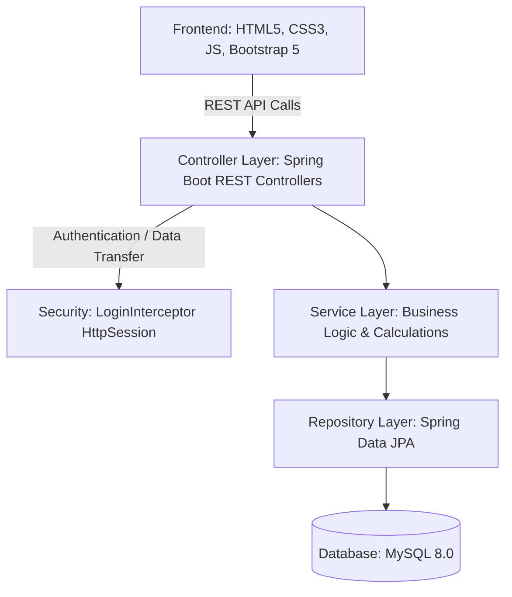
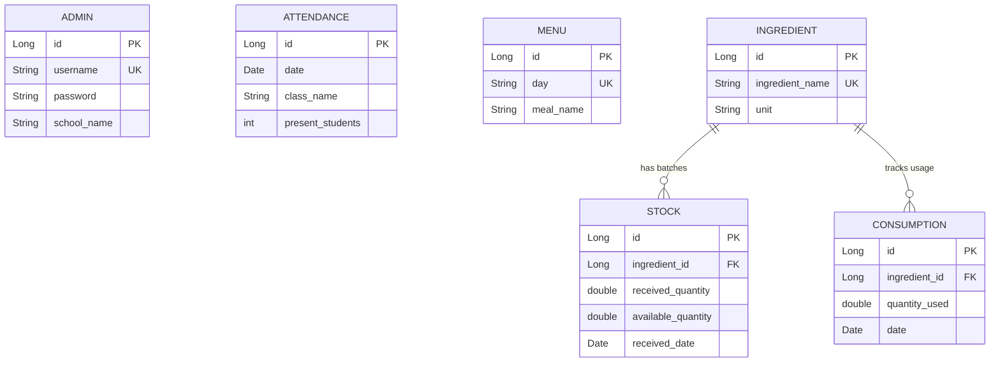

# AnnaSahay – Smart Mid-Day Meal Monitoring & Management System

[](https://annasahay-midday-meal-portal.onrender.com)
[](https://openjdk.org/)
[](https://spring.io/projects/spring-boot)
[](https://www.mysql.com/)
[](https://www.docker.com/)

> 🌐 **Live Web Application**: [https://annasahay-midday-meal-portal.onrender.com](https://annasahay-midday-meal-portal.onrender.com)  
> 🔑 **Demo Login Credentials**: Username: `admin` | Password: `admin123`

AnnaSahay is a Java Full Stack web application designed to monitor and manage the **PM POSHAN (Mid-Day Meal)** scheme in schools. It provides a simple, clean, and secure solution for tracking daily student attendance, managing weekly meal menus, registering ingredients, replenishing stock batches, logging daily meal consumption (with automatic stock deduction), and generating monthly audit reports.

---

## 1. System Architecture

The application is built on a **Layered MVC Architecture** separating presentation, business logic, data access, and data models:



### Key Architectural Concepts
1. **Layered Decoupling**:
   - **Entity Layer**: Java classes mapping directly to MySQL database tables using JPA annotations.
   - **Repository Layer**: Interfaces extending `JpaRepository` to provide ready-made CRUD operations and custom JPQL queries.
   - **Service Layer**: Handles transactional operations, calculations, and complex algorithms (e.g., FIFO stock deduction).
   - **Controller Layer**: Exposes REST endpoints (`@RestController`) consuming and producing JSON data.
2. **Custom Session-Based Security**:
   - Instead of complex Spring Security configurations, the system uses a custom `HandlerInterceptor` (`LoginInterceptor`).
   - On successful credentials check in the `AuthController`, the admin's details are stored in the `HttpSession`.
   - The `LoginInterceptor` intercepts all requests matching `/api/**` (except login/logout/check endpoints) and verifies the presence of the session. If missing, it returns a `401 Unauthorized` JSON response. This is highly interview-friendly as it demonstrates clear understanding of servlet filters and servlet containers.
3. **SPA Frontend Design**:
   - A Single-Page Application (SPA) structure. The UI stays inside `index.html` and switches sections dynamically via JavaScript tab manipulation. This provides instant views and avoids slow multi-page browser reloads.

---

## 2. Database Design & Entity Relationship

The database schema consists of six core tables. The relationships between inventory logs and ingredients are managed using JPA `@ManyToOne` mapping annotations:



### Entity Implementation Details
* **Admin**: Stores school identity and SHA-256 hashed credentials.
* **Attendance**: Tracks class-wise daily counts (Class 1 to 8) dynamically.
* **Menu**: Maps weekdays (Monday–Saturday) to meal names.
* **Ingredient**: Stores raw ingredients and standard units (e.g., `kg`, `liter`).
* **Stock**: Refill ledger. `receivedQuantity` tracks the original invoice amount, while `availableQuantity` tracks the remaining quantity of that specific batch.
* **Consumption**: Tracks daily grain/spice usage.

---

## 3. Module-by-Module Implementation

### A. Login & Authentication Module
* **Backend**: `AuthController` receives username and password. `PasswordUtils` hashes the input password using SHA-256 and compares it to the value in the database. On match, the `Admin` entity is attached as a session attribute: `session.setAttribute("admin", admin)`.
* **Frontend**: The user enters their credentials. On validation error, a custom inline alert is displayed. On success, the container transitions from the `#login-screen` to `#app-container`.

### B. Dashboard Module
* **Backend**: `DashboardController` compiles a single JSON response containing:
  - Cumulative present counts for today.
  - The weekly menu for the current day of the week.
  - Count of low-stock ingredients (available quantity < 10.0 units).
  - The complete list of ingredients and their total balances.
* **Frontend**: Renders metrics cards, compiles alert banners warning about low-stock items, lists the inventory balances in a table, and draws a visual Doughnut chart using **Chart.js** representing stock levels.

### C. Student Attendance Module
* **Backend**: `AttendanceController` receives a JSON array containing attendance logs for Classes 1 to 8 on a selected date. If a class record already exists for that date, the record is updated (`save()` handles both merge and persist).
* **Frontend**: Features a date selector. Selecting a date triggers a GET request fetching that day's attendance. If empty, the present counts default to `0` against standard enrolled ranges (e.g., 30 per class).

### D. Meal Menu Module
* **Backend**: `MenuController` supports standard weekly menu CRUD operations. Day of the week remains a unique key to prevent overlapping schedule records.
* **Frontend**: Lists weekdays (Monday–Saturday) with their configured dishes in a table, allowing the admin to dynamically Add, Edit, or Delete menu configurations using modal popups.

### E. Ingredient Module
* **Backend**: `IngredientController` manages ingredient names and standard measurement units.
* **Frontend**: Simple tabular layout exposing CRUD interfaces. It includes a confirmation modal block before delete operations to prevent accidental record loss.

### F. Stock Pantry Module
* **Backend**: `StockController` handles inward refills. Refilling stock creates a new entry in the `stock` table where the `available_quantity` is initially set equal to the `received_quantity`.
* **Frontend**: Allows user to input inward receipts using dropdown selectors. It includes a client-side search field allowing the user to filter stock items by ingredient name in real time.

### G. Daily Meal Consumption Module (FIFO Stock Deduction)
This is the core business logic of the system.
* **FIFO Deduction Logic**:
  When a daily meal consumption is recorded (e.g., 10 kg of Rice):
  1. The `ConsumptionService` checks the cumulative available balance across all batches of that ingredient. If the total balance is insufficient, it aborts and throws a `RuntimeException`.
  2. If sufficient, it queries the active stock batches of the target ingredient (`availableQuantity > 0.0`), sorted by `receivedDate` ascending (oldest first).
  3. It iterates through the batches, deducting the consumed quantity from `available_quantity` step-by-step:
     - If the oldest batch has more stock than the remaining consumption quantity, it subtracts the quantity and breaks.
     - If the oldest batch has less stock than the remaining consumption quantity, it sets the batch's `availableQuantity` to `0.0`, reduces the remaining quantity to deduct, and proceeds to the next oldest batch.
  4. Stores the consumption record in the ledger database.
* **Consumption Deletion (Stock Reversion)**:
  When a consumption entry is deleted, the system restores the stock to the database batches. It iterates through the batches of that ingredient (oldest first) and fills their `available_quantity` back up to their original `received_quantity` limit until the full amount is restored.

### H. Reports Module
* **Backend**: `ReportController` compiles four types of JSON reports:
  - **Attendance Log**: Class-wise daily statistics over a date range.
  - **Stock Usage Log**: Daily ingredient consumption listings.
  - **Current Inventory**: Current available balances.
  - **Monthly Summary**: Formulates cumulative monthly attendance, average daily attendance, sum of stock refills, and sum of total consumption per ingredient.
* **Frontend**: Provides tabular layout lists. Uses a CSS `@media print` query that automatically hides navbars and sidebar menus, compiling a clean landscape A4 PDF layout for physical printing and auditing.

---

## 4. Complete Project File Structure

Detailed breakdown of all files in the project workspace:

* **[pom.xml](file:///c:/Users/srush/OneDrive/Desktop/Folders/Java%20Full%20Stack%20projects/AnnaSahay_Resume/pom.xml)**: Project object model configuring Spring Boot dependencies (MVC, Validation, JPA) and the MySQL database driver.
* **[src/main/resources/application.properties](file:///c:/Users/srush/OneDrive/Desktop/Folders/Java%20Full%20Stack%20projects/AnnaSahay_Resume/src/main/resources/application.properties)**: Database connection properties, Hibernate configurations, and initialization settings.
* **[src/main/resources/data.sql](file:///c:/Users/srush/OneDrive/Desktop/Folders/Java%20Full%20Stack%20projects/AnnaSahay_Resume/src/main/resources/data.sql)**: SQL script loaded on startup to seed the administrator user, default ingredients, weekly menu, and sample data.
* **[src/main/java/com/annasahay/AnnaSahayApplication.java](file:///c:/Users/srush/OneDrive/Desktop/Folders/Java%20Full%20Stack%20projects/AnnaSahay_Resume/src/main/java/com/annasahay/AnnaSahayApplication.java)**: Spring Boot startup application class.
* **[src/main/java/com/annasahay/entity/](file:///c:/Users/srush/OneDrive/Desktop/Folders/Java%20Full%20Stack%20projects/AnnaSahay_Resume/src/main/java/com/annasahay/entity)**:
  - `Admin.java`: Database entity mapping for Administrator.
  - `Attendance.java`: Database entity mapping for Class-wise Attendance.
  - `Menu.java`: Database entity mapping for Weekly Menu.
  - `Ingredient.java`: Database entity mapping for Ingredient specs.
  - `Stock.java`: Database entity mapping for Stock batches.
  - `Consumption.java`: Database entity mapping for Daily usage logs.
* **[src/main/java/com/annasahay/repository/](file:///c:/Users/srush/OneDrive/Desktop/Folders/Java%20Full%20Stack%20projects/AnnaSahay_Resume/src/main/java/com/annasahay/repository)**:
  - Interfaces extending `JpaRepository` managing basic DB queries.
* **[src/main/java/com/annasahay/service/](file:///c:/Users/srush/OneDrive/Desktop/Folders/Java%20Full%20Stack%20projects/AnnaSahay_Resume/src/main/java/com/annasahay/service)**:
  - `AdminService.java`: Standard logic for password checking.
  - `AttendanceService.java`: Standard logic to save/load class rosters.
  - `MenuService.java`: Logic for menu day setups.
  - `IngredientService.java`: CRUD logic for raw foods.
  - `StockService.java`: Inward receipts and stock summing.
  - `ConsumptionService.java`: Contains the FIFO-based batch deduction and reversion algorithms.
* **[src/main/java/com/annasahay/controller/](file:///c:/Users/srush/OneDrive/Desktop/Folders/Java%20Full%20Stack%20projects/AnnaSahay_Resume/src/main/java/com/annasahay/controller)**:
  - RestControllers processing and returning JSON data payloads to the client.
* **[src/main/java/com/annasahay/config/](file:///c:/Users/srush/OneDrive/Desktop/Folders/Java%20Full%20Stack%20projects/AnnaSahay_Resume/src/main/java/com/annasahay/config)**:
  - `PasswordUtils.java`: Utility class containing the SHA-256 password hashing logic.
  - `LoginInterceptor.java`: Session security inspector checking logged-in admins.
  - `WebConfig.java`: Configures MVC interceptors registry.
* **[src/main/java/com/annasahay/dto/](file:///c:/Users/srush/OneDrive/Desktop/Folders/Java%20Full%20Stack%20projects/AnnaSahay_Resume/src/main/java/com/annasahay/dto)**:
  - `LoginRequest.java` & `ConsumptionRequest.java`: Plain DTOs used to parse incoming REST payloads cleanly.
* **[src/main/java/com/annasahay/exception/](file:///c:/Users/srush/OneDrive/Desktop/Folders/Java%20Full%20Stack%20projects/AnnaSahay_Resume/src/main/java/com/annasahay/exception)**:
  - `GlobalExceptionHandler.java`: Captures RuntimeExceptions and validation failures, formatting them into clear HTTP 400 JSON responses.
* **[src/main/resources/static/](file:///c:/Users/srush/OneDrive/Desktop/Folders/Java%20Full%20Stack%20projects/AnnaSahay_Resume/src/main/resources/static)**:
  - `index.html`: Core single page application framework using Bootstrap 5.
  - `css/style.css`: Custom CSS layout, animations, theme vars, and print rules.
  - `js/app.js`: SPA controller managing user flows, modal controllers, data bindings, API requests, and Chart.js drawing.

---

## 5. Deployment & Run Instructions

### 🚀 Live Cloud Deployment (Production)
- **Public URL**: [https://annasahay-midday-meal-portal.onrender.com](https://annasahay-midday-meal-portal.onrender.com)
- **Database**: Cloud MySQL 8.4 on Aiven
- **Demo Login**: Username: `admin` | Password: `admin123`
- Detailed deployment documentation is available in [DEPLOYMENT.md](DEPLOYMENT.md).

### 🐳 Run with Docker (Single Command)
```bash
docker-compose up --build
```
Access at `http://localhost:8080`.

---

### 💻 Local Development Setup

### 1. Database Configuration
1. Make sure MySQL is running on port 3306.
2. Log in and create the target schema:
   ```sql
   CREATE DATABASE IF NOT EXISTS annasahay;
   ```

### 2. Running via Terminal (Command Line)
You can compile and start the project using the pre-configured Maven build tool:
```bash
./mvnw spring-boot:run
```
*(Or if using the local Maven bin path: `& ".\apache-maven-3.9.6\bin\mvn.cmd" spring-boot:run`)*

### 3. Running via IntelliJ IDEA
1. Open **IntelliJ IDEA**.
2. Select **Open** and choose the root directory `AnnaSahay_Resume`.
3. Verify your **Project SDK** is configured to **JDK 17** (or above) in project settings (`Ctrl + Alt + Shift + S`).
4. Locate the [AnnaSahayApplication.java](file:///c:/Users/srush/OneDrive/Desktop/Folders/Java%20Full%20Stack%20projects/AnnaSahay_Resume/src/main/java/com/annasahay/AnnaSahayApplication.java) main class, right-click, and select **Run 'AnnaSahayApplication'**.

Once started, open **http://localhost:8080** in your browser.
*   **Username**: `admin`
*   **Password**: `admin123`
