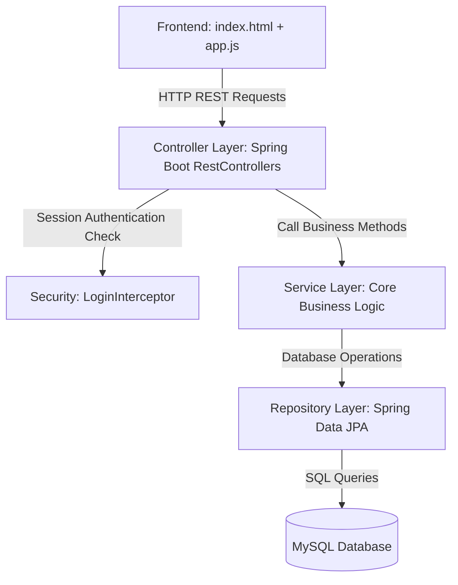
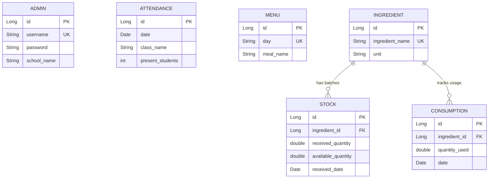

# AnnaSahay Technical Architecture & Learning Guide

Welcome to the complete learning guide for **AnnaSahay – Smart Mid-Day Meal Monitoring & Management System**. This guide provides an in-depth breakdown of the project's architecture, database design, core algorithms, frontend execution, and potential interview questions to help you master every aspect of the project.

---

## 1. Architectural Design & MVC Flow

AnnaSahay is built using a **Layered MVC (Model-View-Controller) Architecture**. In this system, each layer has a distinct responsibility, which ensures loose coupling, clean organization, and maintainability.



### The Request-Response Lifecycle
1. **Presentation Layer (View)**: The user interacts with the UI in `index.html`. For example, they record a consumption of 5kg of Rice. A JavaScript event handler in `js/app.js` captures this input and sends a `POST` request with a JSON payload to `/api/consumption`.
2. **Security Interceptor**: The request is intercepted by `LoginInterceptor`. It checks if the `HttpSession` contains an active `admin` user object. If not authenticated, it blocks the request and returns a `401 Unauthorized` status. If authenticated, the request proceeds.
3. **Controller Layer (Controller)**: `ConsumptionController` receives the request. It parses the JSON payload into a Data Transfer Object (`ConsumptionRequest`) and maps it to a controller method. It then calls the transactional service method: `consumptionService.recordConsumption(...)`.
4. **Service Layer (Model - Service)**: The `ConsumptionService` coordinates the business logic. It checks if there is enough stock of Rice, queries active stock batches from oldest to newest, executes the **FIFO deduction algorithm**, and updates the database records.
5. **Repository Layer (Model - Repository)**: The service layer accesses the database via `ConsumptionRepository` and `StockRepository`. These interfaces extend `JpaRepository` and run custom query methods or automatic SQL bindings.
6. **Data Storage (Database)**: MySQL updates the `consumption` and `stock` tables. The controller packages the output into a JSON response, which is returned to the frontend. JavaScript updates the DOM to show the new stock balances and displays a success alert.

---

## 2. Database Schema & Hibernate Entity Relationships

The relational database is structured to track ingredients, stock batches, and daily usage logs:



### Entity Annotations Details
- **`@Entity`**: Instructs Hibernate that the class maps directly to a MySQL database table.
- **`@Table`**: Declares the name of the database table (e.g. `@Table(name = "stock")`).
- **`@Id` & `@GeneratedValue`**: Defines the primary key and configures it to auto-increment (`GenerationType.IDENTITY`).
- **`@ManyToOne`**: Established in `Stock` and `Consumption` entities to link them back to their parent `Ingredient`. In `Stock.java`:
  ```java
  @ManyToOne
  @JoinColumn(name = "ingredient_id", nullable = false)
  private Ingredient ingredient;
  ```
  This creates a Foreign Key `ingredient_id` inside the `stock` table mapping to the `id` column of the `ingredient` table.

---

## 3. Core Algorithm: FIFO Stock Deduction

The most complex business logic in the application is the **First-In, First-Out (FIFO)** stock deduction. When a meal is cooked, the oldest stock batch of that ingredient must be consumed first.

### Step-by-Step Execution of FIFO Deduction
1. **Fetch Total Available Balance**: The system queries all active stock records for the target ingredient where `availableQuantity > 0`. It sums up the available quantities to check if there is enough total stock to fulfill the request. If total stock is insufficient, it throws a `RuntimeException` (which gets caught by `GlobalExceptionHandler` and shown as an error to the user).
2. **Fetch Batches sorted by Date**: The system queries active stock records of that ingredient, sorted by `receivedDate` ascending (oldest first):
   ```java
   List<Stock> activeBatches = stockRepository.findByIngredientIdAndAvailableQuantityGreaterThanOrderByReceivedDateAsc(ingredientId, 0.0);
   ```
3. **Loop & Deduct**: The service loops through the list of batches and deducts the consumed quantity:
   - **Scenario A**: The current oldest batch has *more* available stock than the remaining amount to deduct:
     - Subtract the remaining amount from the batch's `availableQuantity`.
     - Set remaining amount to `0`.
     - Break the loop.
   - **Scenario B**: The current oldest batch has *less or equal* available stock than the remaining amount to deduct:
     - Deduct all available stock from this batch (set `availableQuantity` to `0.0`).
     - Reduce the remaining amount to deduct by the batch's available amount.
     - Save the updated batch.
     - Move to the next oldest batch.
4. **Log Consumption**: A new `Consumption` record is saved in the database to log the exact amount consumed and the date of consumption.

### Reverse Logic: Consumption Deletion (Stock Reversion)
When a consumption entry is deleted, the stock must be returned back to the batches.
1. The system looks up the target `Consumption` record and finds the corresponding ingredient and the `quantityUsed` to return.
2. It fetches all stock batches of that ingredient, sorted by `receivedDate` ascending (oldest first).
3. It iterates through the batches and adds the stock back, but **cannot exceed the original invoice limit** (`receivedQuantity`).
4. If a batch is not full (`availableQuantity < receivedQuantity`), it restores the stock up to its original `receivedQuantity` and reduces the remaining amount to restore. It proceeds until the entire consumed quantity is fully refunded to the inventory ledger.

---

## 4. Custom Session-Based Security (Login Interceptor)

Instead of incorporating heavy security frameworks like Spring Security, AnnaSahay uses a custom, lightweight session-based filter called **`LoginInterceptor`** (which extends Spring's `HandlerInterceptor`). This makes it highly readable and perfect for technical resume projects.

### How it works:
1. **Login**: When the admin enters their username and password, the server checks the hash in `PasswordUtils` (SHA-256). On a successful match, the admin object is stored inside the HTTP Session:
   ```java
   session.setAttribute("admin", admin);
   ```
2. **Interception**: All incoming requests matching `/api/**` (except auth-check, login, and logout endpoints) are intercepted by the `preHandle()` method of `LoginInterceptor.java`:
   ```java
   @Override
   public boolean preHandle(HttpServletRequest request, HttpServletResponse response, Object handler) throws Exception {
       HttpSession session = request.getSession(false);
       if (session != null && session.getAttribute("admin") != null) {
           return true; // Proceed to Controller
       }
       response.sendError(HttpServletResponse.SC_UNAUTHORIZED, "Unauthorized");
       return false; // Block request
   }
   ```
3. **Registration**: The interceptor is registered in `WebConfig.java` so that Spring MVC knows to apply it to REST endpoints.

---

## 5. Single-Page Application (SPA) Frontend

The frontend is a lightweight SPA built inside `index.html`. It delivers desktop-like app speed by avoiding slow, page-reloading navigations.

- **Dynamic Transitions**: Sections of the application are defined in `index.html` within wrappers (e.g. `<div id="tab-dashboard">`, `<div id="tab-ingredients">`). All wrappers except the active one have the Bootstrap utility class `d-none` (display: none).
- **Tab Switching**: When a user clicks a sidebar link, the JavaScript function `switchTab(tabId)` is triggered. It removes the `.active` class from other links, hides all tab panes by adding `d-none`, and shows the selected tab pane by removing `d-none`.
- **Lazy Loading**: When a tab is displayed, it triggers an AJAX fetch request to load the data (e.g., `loadStockTab()`) in real time, keeping the database load minimal.

---

## 6. Technical Interview / Viva Voce Q&A

Here are the most common questions an interviewer might ask about this codebase, along with the ideal responses:

### Q1: What is the benefit of a layered architecture in Spring Boot?
> **Answer**: A layered architecture separates concerns. The **Entity layer** maps database tables, the **Repository layer** handles SQL queries, the **Service layer** encapsulates core business logic (like the FIFO algorithm), and the **Controller layer** handles HTTP routing. This makes code modular, easier to test, and clean to maintain.

### Q2: Why did you choose custom Session Security over Spring Security?
> **Answer**: For this specific portal, a custom `HandlerInterceptor` was chosen to showcase a deep, fundamental understanding of how Servlet filters, HTTP Sessions, and interceptors function under the hood in Java. Spring Security hides many lifecycle layers, whereas implementing a custom interceptor directly shows how authentication tokens are validated and how sessions are managed programmatically.

### Q3: How does the FIFO stock deduction handle transactional safety?
> **Answer**: The deduction method in `ConsumptionService` is annotated with **`@Transactional`**. If any error occurs during the FIFO loop (such as the database failing to save an updated batch, or a sudden loss of network connection), the entire operation is rolled back automatically. This prevents partial deductions where stock is decreased but no consumption ledger is created.

### Q4: Why is there a `createDatabaseIfNotExist=true` parameter in `application.properties`?
> **Answer**: This parameter instructs the MySQL JDBC driver to automatically create the database schema (e.g. `annasahay`) if it doesn't already exist when the application boots up. Combined with Hibernate's `spring.jpa.hibernate.ddl-auto=update`, the application can bootstrap itself on any local machine with zero manual SQL configuration.

### Q5: How do you handle database seeding?
> **Answer**: We use Spring Boot's built-in SQL initialization support. The file `src/main/resources/data.sql` contains default insert statements. In `application.properties`, `spring.sql.init.mode=always` and `spring.jpa.defer-datasource-initialization=true` are configured. This ensures Hibernate creates the tables first, and then the seed scripts populate the initial administrator, default ingredients, and menu schedules automatically.
